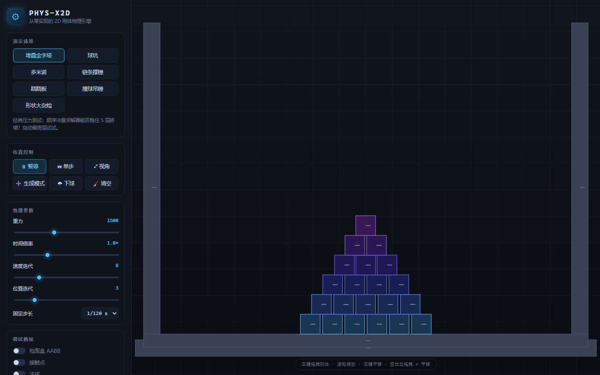

# PhysX2D — 从零实现的 2D 刚体物理引擎

纯前端、可离线运行的 2D 刚体物理引擎演示。碰撞检测、冲量求解、关节、休眠全部手写实现，
**不依赖任何现成物理库**（引擎核心约 2,300 行 TypeScript）。

> 本项目由 **DeepSeek 搭配 DeepSeek Harness (DSH)** 生成，收录于
> [dsh-web-showcase](https://github.com/snake-aabb-wtf/dsh-web-showcase) 作品集。



## 技术栈

- **React 18 + TypeScript**（strict 模式）
- **Vite** 构建（`base: './'`，产物可部署到任意静态路径 / 离线打开）
- **Canvas 2D** 渲染（无 WebGL、无任何物理/渲染库）
- 物理引擎为纯 TypeScript 模块，不依赖 React / DOM，可无头运行与自动化测试

## 快速开始

```bash
# 进入项目目录
cd physx2d

# 安装依赖
npm install

# 开发模式（http://localhost:5173）
npm run dev

# 生产构建（产物在 dist/）
npm run build

# 本地预览构建产物
npm run preview
```

## 操作说明

| 操作 | 效果 |
| --- | --- |
| 左键拖拽刚体 | 鼠标关节（力型弹簧）拖动，甩动后可"扔"出 |
| 左键拖拽空白 / 右键拖拽 | 平移相机 |
| 滚轮 | 以鼠标为中心缩放相机 |
| 「生成模式」+ 点击 | 在世界中生成随机刚体（圆/矩形/多边形） |
| 侧栏「下球」「清空」 | 批量生成 / 清空动态刚体 |
| 调试叠加开关 | AABB / 接触点 / 法线 / 速度向量 / 关节 |
| 物理参数滑杆 | 重力、时间倍率、速度/位置迭代数、固定步长（实时生效） |

## 演示场景

| 场景 | 展示的物理现象 |
| --- | --- |
| 堆叠金字塔 | 顺序冲量 + 热启动 + 岛屿休眠的稳定性（21 块砖约 0.7s 内整岛入睡） |
| 球坑 | 恢复系数混合规则、漏斗与收集盆、弹跳 |
| 多米诺 | 连锁反应、细长刚体的碰撞 |
| 链条摆锤 | 距离关节链、摆锤动力学 |
| 跷跷板 | 单点接触支撑（顶点-平面）、力矩平衡 |
| 撞球吊锤 | 摆锤撞墙、砖块碎裂散落 |
| 形状大杂烩 | SAT 对任意凸多边形（三角形/五边形/六边形）一视同仁 |

## 技术架构

```
src/
├── engine/                 # 物理引擎（纯 TS，无 React/DOM 依赖）
│   ├── math/Vec2.ts        # 向量与旋转矩阵
│   ├── bodies/Body.ts      # 刚体：位置/速度/质量/恢复系数/摩擦/阻尼/休眠
│   ├── bodies/Shape.ts     # 形状：CircleShape / PolygonShape（凸多边形，质心自动平移）
│   ├── collision/AABB.ts   # 轴对齐包围盒
│   ├── collision/BroadPhase.ts   # 广相：空间哈希网格（O(n) 候选对）
│   ├── collision/NarrowPhase.ts  # 窄相：SAT + 参考边/入射边裁剪（面接触双点）
│   ├── collision/Manifold.ts     # 接触流形（法线 + 1~2 接触点 + 热启动冲量）
│   ├── dynamics/ContactSolver.ts # 顺序冲量求解器 + split impulse 位置修正
│   ├── dynamics/Joints.ts  # DistanceJoint（距离/绳）/ MouseJoint（力型弹簧拖拽）
│   └── World.ts            # 固定步长流水线（累加器）与岛屿休眠（union-find）
├── render/Renderer.ts      # Canvas 2D 渲染 + 相机（缩放/平移）+ 调试叠加层
├── demo/scenes.ts          # 7 个演示场景
└── App.tsx                 # React 控制面板（场景/参数/统计/调试开关）
```

## 物理引擎要点

- **固定时间步长 1/120s**：渲染循环用累加器把帧间隔切成整数个固定步（Gaffer On Games,
  *Fix Your Timestep*），仿真表现与帧率无关。
- **半隐式欧拉积分**：先更新速度再更新位置，稳定性优于显式欧拉。
- **广相**：空间哈希网格，同格刚体两两构成候选对；`pairCount` 可在统计面板观察。
- **窄相**：多边形-多边形用 SAT 分离轴定理，选定参考边/入射边后用两侧裁剪平面生成
  1~2 个接触点（面接触双点是大面积稳定堆叠的关键）；法线统一"从 A 指向 B"。
- **顺序冲量求解**：每个接触点拆成法向（单向，不可拉）与切向（库仑摩擦 `|P_t| ≤ μ·P_n`）
  两个 1D 约束，整张接触链迭代 8 轮让冲量"传导"收敛；热启动按接触特征 id 跨帧
  恢复累积冲量，加速收敛。
- **恢复系数**：`λ = −(vn − bias)·kNormal⁻¹`，bias = −e·vn（闭合速度超过阈值时生效），
  摩擦取几何平均、恢复取大值（Box2D 同款混合规则）。
- **split impulse 位置修正**：修正冲量不进入速度，避免 Baumgarte 给系统注入能量的
  "弹跳"假象；每轮修正剩余穿透的 20%，穿透容差 0.02px。
- **岛屿休眠**：通过接触/关节连通的刚体组成岛屿，仅当**全岛成员**都低速运动 0.4s 时
  整岛同时入睡（union-find 连通分量判定），避免"单个入睡 → 被邻居触碰唤醒"的振荡；
  被高速撞击（闭合速度 > 25px/s）或鼠标抓住时唤醒。
- **长链收敛**：距离关节的约束求解按链逐级传导，迭代不足时链尾会缓慢拉长（"漏沙"）。
  位置修正采用**全量求解**（每轮直接修到位，仅防爆钳制 ±20px），并支持
  **场景级迭代声明**（链条场景 40 速度迭代 / 24 位置迭代），长链稳态误差 < 1px/关节。
- **关节**：DistanceJoint 约束两锚点距离（支持软弹簧频率参数）；MouseJoint 采用
  **力型弹簧**（F = k·Δx − c·v，|F| ≤ maxForce，maxForce 按质量缩放）——相比累积冲量
  钳制的约束写法，不会出现"饱和锁死"（刚体冻结在距光标处不动的死点）。

## 验证与自测

| 脚本 | 内容 | 结果 |
| --- | --- | --- |
| `verify/smoke_test.py` | Playwright 冒烟：页面加载、场景切换、拖拽、无控制台错误 | ✅ 通过 |
| `verify/deep_test.py` | Playwright 深度断言 15 项：堆叠休眠与零穿透、多米诺连锁、链条无拉长、跷跷板倾斜、吊锤破墙、鼠标拖拽、滑杆联动 | ✅ 15/15 |

> 需先在 `physx2d` 目录运行 `npm run dev`（默认 5173 端口）后执行：
> `python verify/smoke_test.py` / `python verify/deep_test.py`（依赖 Python Playwright）。

## 已知限制

- 无 CCD（连续碰撞检测）：超高速刚体可能穿透薄墙（演示速度下未触发）。
- 只支持凸多边形（凸包）；凹形状需分解。
- 拖拽可把刚体"塞"进其他刚体（无 CCD），求解器会将其挤出。

## 许可证

本仓库（含本项目）以 [MIT License](../LICENSE) 授权。
